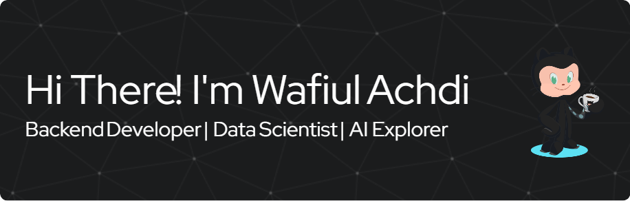

<h2 align="left">About me</h2>

I’m a passionate **Backend Developer** and **Data Enthusiast** specializing in building scalable backend systems and exploring Artificial Intelligence & Machine Learning.

- 🔭 I’m currently working on backend APIs and deploying ML models in production  
- 🌱 I’m currently learning MLOps and advanced model deployment techniques  
- 👯 I’m looking to collaborate on open-source AI and backend projects  
- 💬 Ask me about backend development, data engineering, and machine learning  
- 📫 How to reach me: **achdiwafiul@gmail.com**
- ⚡ Fun fact: I love combining data science with backend engineering to build intelligent applications!

<h2 align="left">Tech Stack</h2>

###

  
  
  
  
  
  
  
  
  
  
  
  
  
  
  
  
  
  
  
  
  
  
  
  
  
  
  
  
  
  
  
  
  
  
  
  
  
  
  
  
  
  
  
  
  
  
  

###

<h2 align="left">Social Media</h2>

###

  
  
  
  

###

<picture>
  <source media="(prefers-color-scheme: dark)" srcset="https://raw.githubusercontent.com/waifull/waifull/output/pacman-contribution-graph-dark.svg">
  <source media="(prefers-color-scheme: light)" srcset="https://raw.githubusercontent.com/waifull/waifull/output/pacman-contribution-graph.svg">
  
</picture>

###

###

